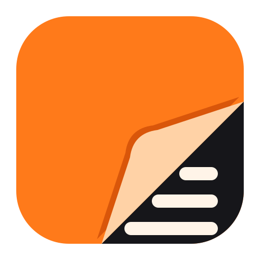
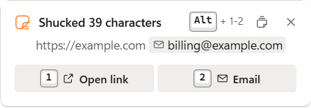
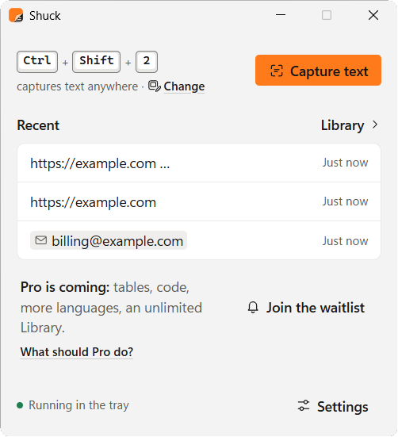
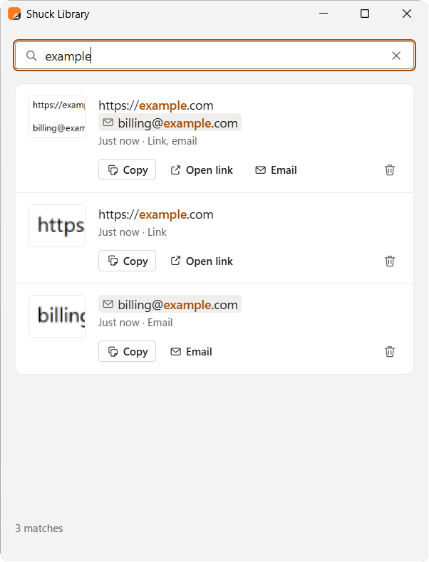

  

<h1 align="center">Shuck</h1>

<b>That text you can't select? Now you can.</b> 
Pixels in. Text out. Free for Windows.

  <a href="https://github.com/shuck-app/shuck/releases/latest"><b>Download for Windows</b></a>

  <a href="#install">Install</a> ·
  <a href="https://github.com/shuck-app/shuck/issues/new/choose">Report a problem</a> ·
  <a href="https://github.com/shuck-app/shuck/discussions">Ideas</a> ·
  <a href="PRIVACY.md">Privacy</a> ·
  <a href="LICENSE.md">Licence</a>

Video subtitles. Screenshots. Error boxes. Scanned PDFs. A remote desktop that won't let you copy. If it's on your screen, Shuck turns it into text you can paste.

## How it works

1. Press **Ctrl+Shift+2**. Your screen holds still, even a playing video.
2. Drag over the text you want.
3. Paste anywhere. It's already on your clipboard.

That's it. Shuck reads the text right on your PC, so it works offline, with no account and no uploads.

## What else it does

- **Spots links and emails.** You get an **Open link** or **Email** button. Click it, or press Alt+1, 2 or 3.
- **Reads QR codes and barcodes.** Drag closely around a code and its contents are ready to paste. Inside a bigger selection, you get a **Copy code** button.
- **Keeps your last 20.** Search them, copy one again, delete with undo. Pause it any time, or turn it off.
- **Your line breaks, your call.** Keep them as on screen, or join lines into paragraphs.
- **Your shortcut.** Pick your own combo with Ctrl or Alt. Shuck tells you if another app already has it.
- **Quiet by design.** Lives in the tray, starts with Windows (you can turn that off), and lets you know when there's a new version.
- **Built for everyone.** Works with the keyboard and screen readers, with text up to 225%.

  
  
  

**Good to know:** this version reads English. If text looks like another language, Shuck says so (at most once a week). Tables paste as plain text, one row per line.

## Install

**[Download the latest version](https://github.com/shuck-app/shuck/releases/latest)**, run `Shuck_x.y.z_x64-setup.exe`, and you're set. No admin rights needed.

<b>Seeing "Windows protected your PC"?</b>

Shuck isn't code-signed yet. Certificates cost money and Shuck is free, so Windows shows a warning the first time:

1. Click **More info**.
2. Check the file name starts with `Shuck_` and came from this page.
3. Click **Run anyway**.

**You'll need:** Windows 10 or 11 (64-bit) and about 20 MB. Shuck uses Microsoft's WebView2, which Windows 11 already has. If it's missing, the installer gets it from Microsoft once.

**Updates:** once a day, Shuck asks GitHub if there's a newer version and lets you know in the app. You can turn that off in Settings. To update, download the new installer and run it. Your captures and settings stay.

**Uninstalling:** Windows Settings → Apps, find Shuck in your installed apps, then Uninstall. Tick **Also delete my captures and settings** to remove everything.

## Shuck Pro is coming

Tables that paste as cells. Code that keeps its indentation. More languages. A Library with no limit.

Tell us what you'd want in **[What should Pro do?](https://github.com/shuck-app/shuck/discussions/categories/what-should-pro-do)**. Pressing **Join the waitlist** in Shuck adds one anonymous count, so we know how many people want Pro. It doesn't sign you up for anything. With update checks on, Shuck lets you know when there's a new version.

## Need help?

- **Something broke?** [Report a problem](https://github.com/shuck-app/shuck/issues/new/choose). In Shuck, **Settings → About → Report a problem** copies diagnostics for you to paste (built to leave out captured text and images).
- **Got an idea or a question?** [Discussions](https://github.com/shuck-app/shuck/discussions).
- **Uninstalled it?** [Tell us why](https://github.com/shuck-app/shuck/discussions/categories/uninstalled-tell-us-why).
- **Found a security issue?** [Report it privately](https://github.com/shuck-app/shuck/security/advisories/new).

Issues and Discussions are public, so please don't post captured text or screenshots of your screen.

## Privacy

Shuck doesn't upload your captures. No account, no analytics, no telemetry. Shuck itself goes online in two cases: the daily update check (you can turn it off), and when you press **Join the waitlist**, which sends one word: where you pressed it. The full version is in **[PRIVACY.md](PRIVACY.md)**. Private questions: shuck.privacy@gmail.com.

## Licence

Free to use, at home or at work. Not open source: © 2026 Ansh Srivastava, all rights reserved. Please don't sell it, share modified copies or reverse engineer it, and share a link to this page rather than the installer file. Full terms in **[LICENSE.md](LICENSE.md)**. Open-source components keep their own licences, listed in **Settings → About → Open-source licences**.

This repo holds releases, docs and feedback. The source code is private.

Made by Ansh Srivastava ([@xblackwaterx](https://github.com/xblackwaterx)).
